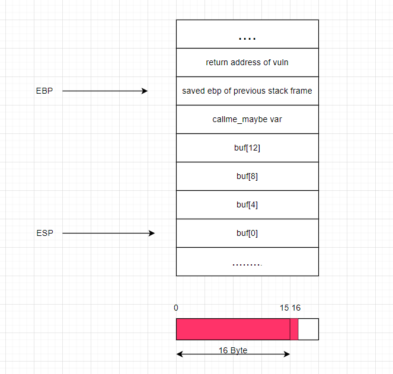
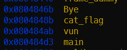
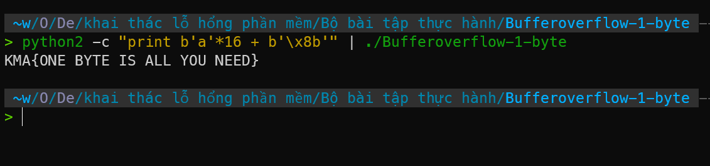

# BOF1

## source code

```c
int Bye()
{
system("echo Byte byte =]]");               
exit(0);
}

int cat_flag()
{
system("cat flag");
exit(0);
}

void vun()
{
int (*callme_maybe)() = (int(*)())Bye;
char buff[16];                      
read(0, buff, 17);  // arr buff có size 16byte nhưng read 17byte => overflow 1byte
callme_maybe();
}

int main ()
{
vun();
return 0;
}

```

## Solution



Biến `callme_maybe` được gán giá trị bằng địa chỉ hàm `Bye` => khi gọi `callme_maybe()` sẽ gọi hàm `Bye`. Mình có lỗi buffer overflow 1 byte ở hàm `vun` => thay đổi giá trị của byte có địa chỉ thấp nhất của biến `callme_maybe`. Với little edian, byte cuối cùng trong biểu diễn nhị phân sẽ có địa chỉ thấp hơn. Tức là nếu `callme_maybe` có giá trị là `0x123456XX` thì ta có thể thay đổi nó thành `0x123456YY` với `YY` là giá trị mà mình mong muốn.

Sử dụng gdb để lấy địa chỉ của hàm `cat_flag` và `Bye`:



Địa chỉ 2 hàm này chỉ khác nhau 1 byte cuối, thỏa mãn điều kiện nói ở trên => ta có thể thay đổi giá trị của `callme_maybe` thành địa chỉ của hàm `cat_flag` => khi gọi `callme_maybe()` sẽ gọi hàm `cat_flag` => lấy flag.



Vì byte 0x8b ko thể được nhập từ bàn phím do nó ko thuộc bảng mã ascii => ta sẽ sử dụng python để in ra byte này và redirect vào chương trình qua pipe.

## *RECOMMEND: Dùng python2*