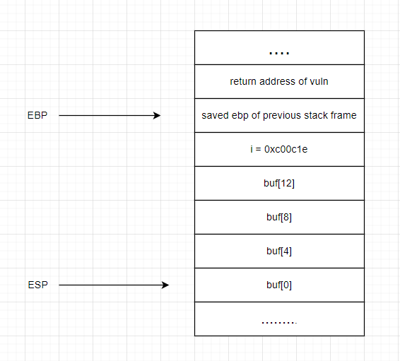
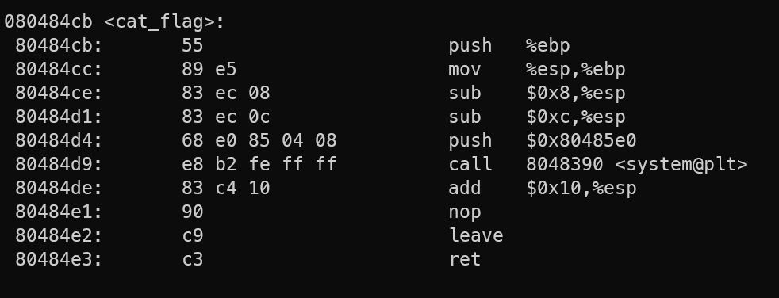
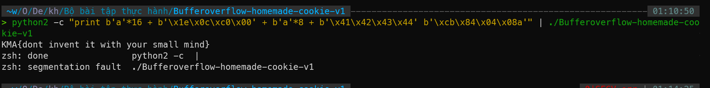

# BOF2

## source code

```c
void cat_flag()
{
system("cat flag");
}

void vun()
{
int i = 0xc00c1e;
char buff[16];
gets(&buff);
printf("%s", buff);
if (i != 0xc00c1e)
{
printf("DONT SMASH THE STACK PLZ!\n");
exit(0);
}
}

int main ()
{
vun();
return 0;
}
```

bài này bị dính lỗi buffer overflow, do array `buff[16]` chỉ có size là 16byte, tuy nhiên hàm `gets` lại đọc input có độ dài tối đa tùy ý. Chỉ dừng lại khi gặp kí tự `\n` hoặc `EOF`. Do đó, ta có thể nhập vào 1 chuỗi có độ dài bất kì lớn hơn 16byte => buffer overflow.

## Solution



`return address` của hàm vuln là địa chỉ câu lệnh sẽ được thực thi sau khi hàm vuln kết thúc và return. Trong trường hợp này, ta muốn thực thi hàm `cat_flag` => ta cần tìm địa chỉ của hàm `cat_flag` và ghi đè lên `return address` của hàm `vuln`.

Để tìm địa chỉ của hàm `cat_flag`, ta sử dụng lệnh `objdump -d bof2` để xem mã assembly của hàm `cat_flag`:



Một điều cần lưu ý là giá trị của biến `i` không được thay đổi. Nếu không hàm `vuln` sẽ không return về main mà thực thi lệnh trong nhánh `if` rồi exit. Do đó trong quá trình overflow, ta cần ghi đè đúng giá trị của biến `i` vào vùng nhớ của biến `i` trong stack. Với little endian, nó sẽ là `1e0cc000`. Vậy payload khai thác sẽ là:

` 16 bytes của buffer + \x1e\x0c\xc0\x00 + 8byte stack align + 4 byte giá trị random để ghi đè saved ebp + địa chỉ của hàm cat_flag`

Việc thêm align vào stack do trình biên dịch sẽ tự động thêm vào để đảm bảo stack frame được align 16byte. Để biết chính xác layout của stack frame, hãy sử dụng các công cự reverse engineering.



