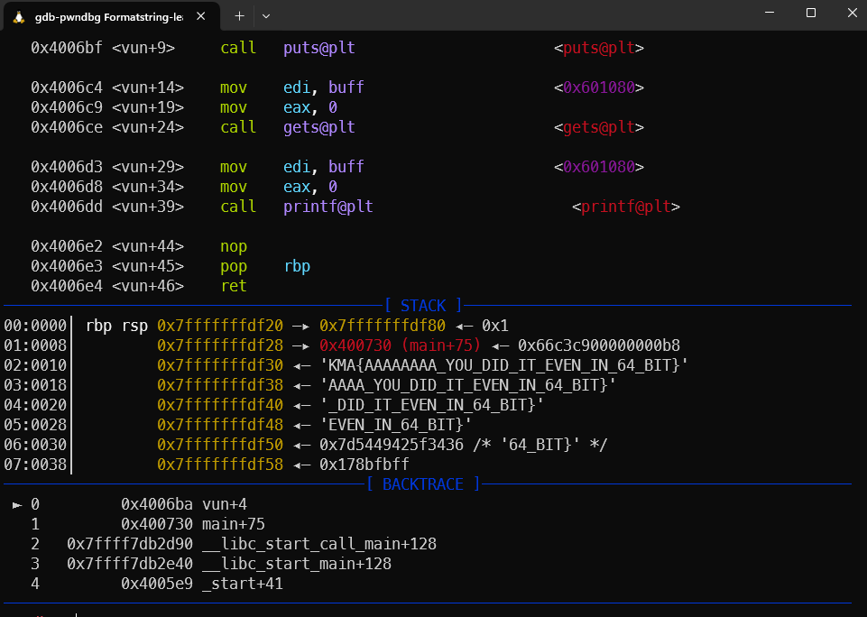
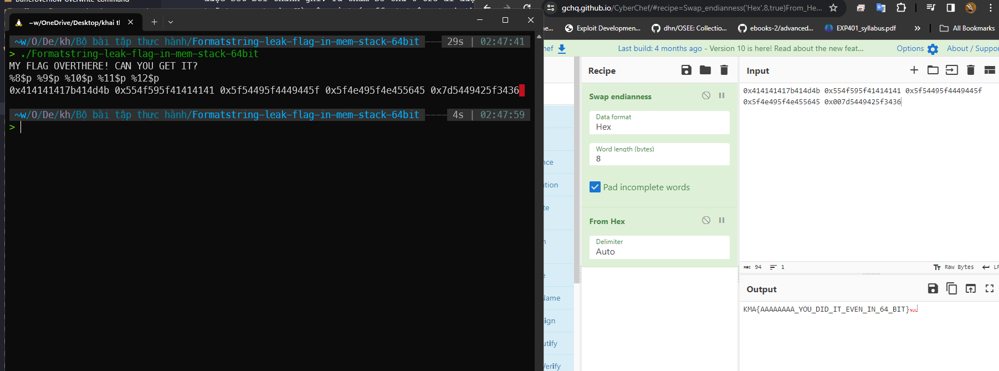

# solution

cách làm same vs 32bit, tuy nhiên với 64bit 5 tham số đầu được set bởi thanh ghi. Từ tham số thứ 6 trở đi được lưu trữ trong stack. Vì vậy vị trí offset trên stack thay đổi. với 32 bit thì đỉnh stack là offset 0, còn với 64 bit thì đỉnh stack là offset 6.

