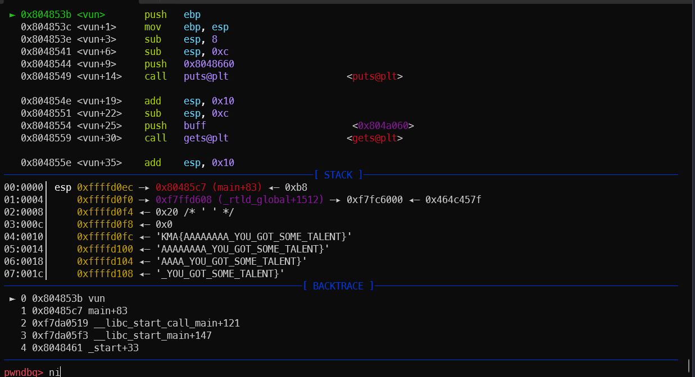
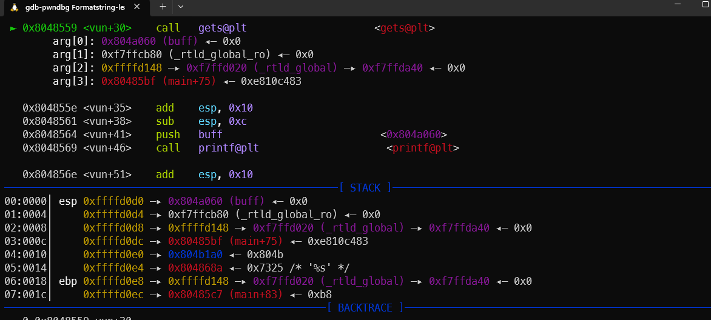
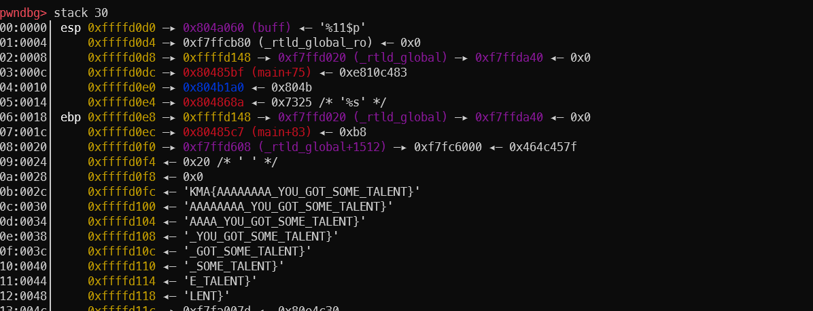
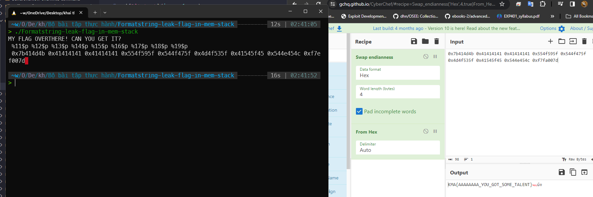

# solution

Khi bắt đầu vào hàm vun, flag được đọc vào stack từ địa chỉ `0xffffd0fc`

đỉnh stack của hàm vun có giá trị `0xffffd0d0` và input được đọc vào biến global.

flag bắt đầu từ offset 11.

