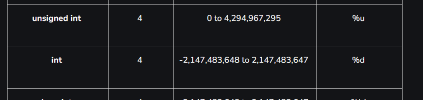
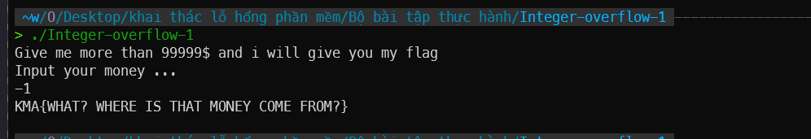

# 

## source code

```c
#include <stdio.h>
#include <stdlib.h>

void vun()
{
unsigned int temp;
char buff[4];
printf("Give me more than 99999$ and i will give you my flag\n");
printf("Input your money ...\n");
read(0, buff, 3);
temp = atoi(buff);
if (temp > 99999)
system("cat flag");
else
printf("ONLY %d$ ??? YOU CANT GET MY FLAG! BYEEEEEEEEEE!\n", temp);
}

int main ()
{
vun();
return 0;
}
```

## solution

hàm `atoi` trả về giá trị có kiểu dữ liệu `int`, `temp` có kiểu dữ liệu `unsigned int`.



nếu nhập `-1` thì lưu trong bộ nhớ sẽ là `0xffffffff` và `temp` sẽ có giá trị là `4294967295` khi đổi sang kiểu `unsigned int` lớn hơn `99999` nên sẽ in ra flag. Hoặc bất kì giá trị âm nào trong kiểu dữ liệu `int` cũng được.

