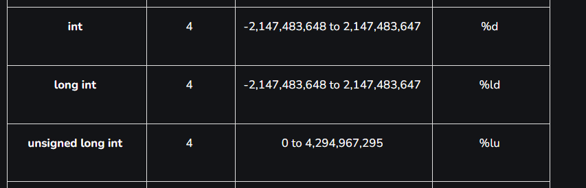
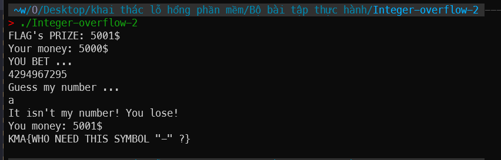

# solution

hàm `strtoul` trả về giá trị có kiểu dữ liệu `unsigned long`, `your_bet` có kiểu dữ liệu `int`. Do đó ta có thể nhập một giá trị dương mà khi đổi sang kiểu `int` lại là một giá trị âm.



Chỉ cần nhập lớn hơn `2147483647` thì `your_bet` sẽ có giá trị âm. Nhập càng lớn thì giá trị âm càng nhỏ.



`4294967295 = 0xffffffff`

đổi sang kiểu `int` thì sẽ là `-1`

`your_money -= your_bet;`

tương đương với +1, thỏa mãn

```c
if (your_money > 5000)
system("cat flag");
```