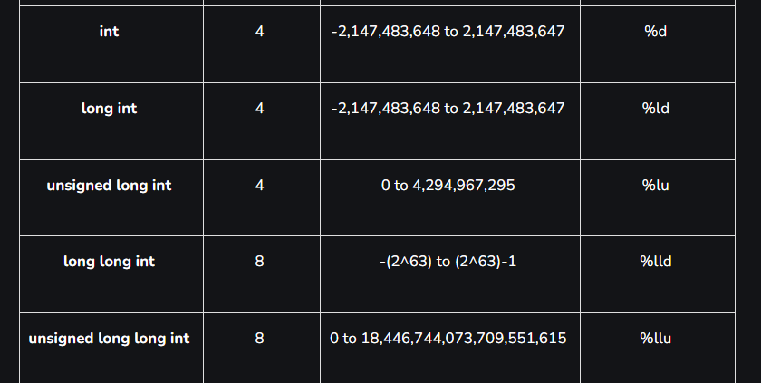
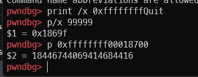
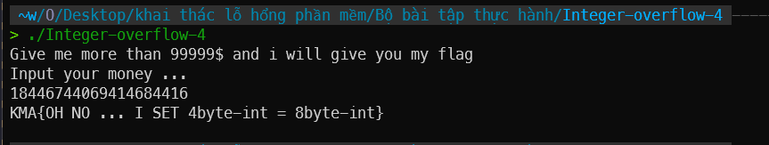

# Solution

`strtoull` có kiểu dữ liệu trả về là `unsigned long long` có size 8 byte. Tuy nhiên `money_give` có kiểu `int` chỉ 4 byte. biến `temp` có kiểu `long long int` bao gồm cả giá trị âm.

Như vậy ta chỉ cần nhập một số có giá trị nhỏ hơn `99999` theo kiểu `long long int` và có 4 byte cuối giá trị lớn hơn `99999`.

